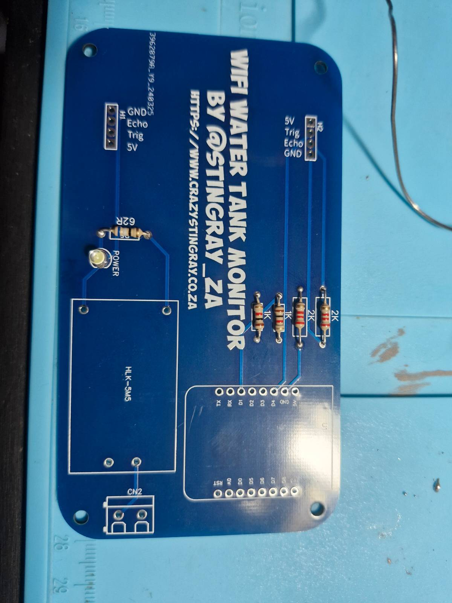
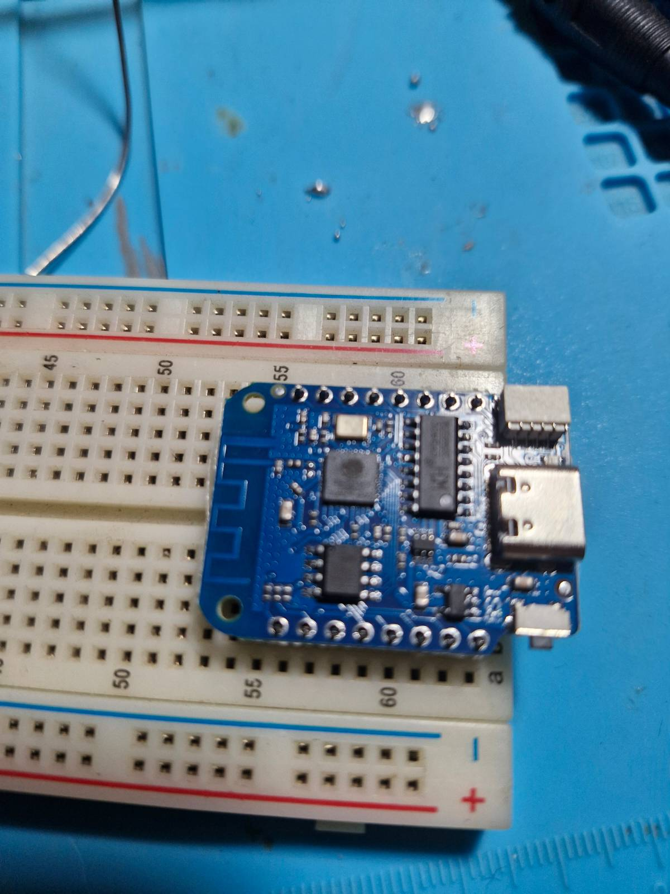
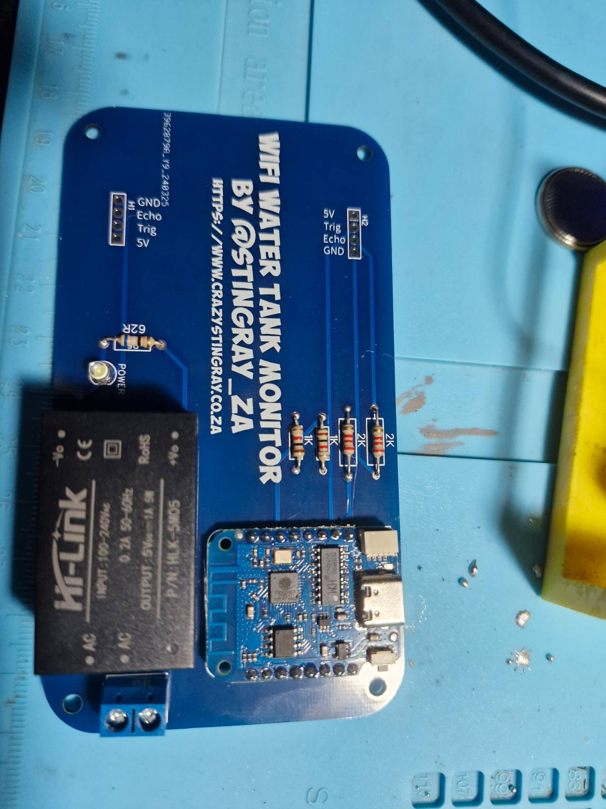
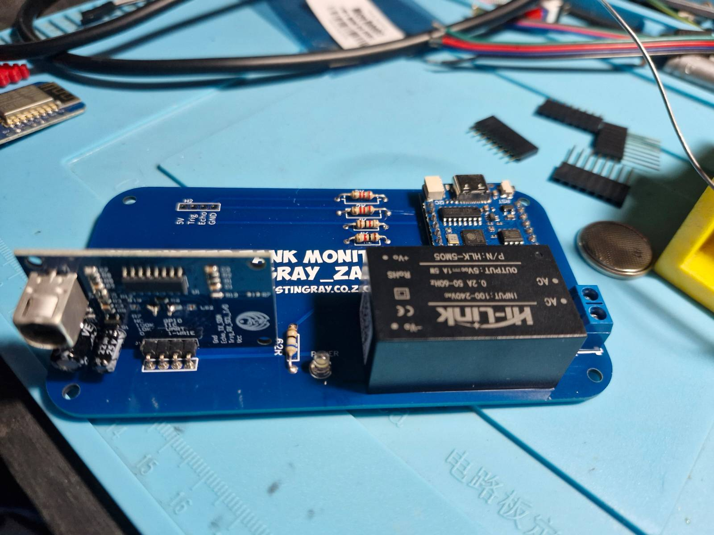

# DIY Water Tank Level Sensor – No Home Assistant

This post will help you to build, configure and set up the tank level monitor using ESPHome, but we will be using the integrated web server provided by ESPHome to access the sensor data.

This project was created with the home DIY’er in mind. Since the SMD components are so teeny tiny these days, I have opted to use through hole components to make sure that you only need a regular soldering iron to assemble.

You will require the following items to assemble the PCB:  
\* 1 x D1 Mini Node MCU V4  
\* 2 x 2K 1/4w Through Hole Resistors  
\* 2 x 1K 1/4w Through Hole Resistors  
\* 1 x HLK-5M5 / HLK-5M05 Transformers  
\* 1 x 62 Ohm 1/4w Through Hole Resistor or whatever you have that's closest. I used a 68 Ohm as I didn't have a 62 Ohm on hand.
\* 1 x 3mm LED (Any color you prefer)  
\* 1 x 2-pin Screw Terminal  
\* 1/2 x Weather-proof Ultrasonic Sensor Probe AJ-SR04M (One or Two depending on if you want to monitor one or two tanks)  
\* 1 x Waterproof Enclosure ( I’ve opted for a 110cm x 110cm enclosure from my local hardware store )  
\* 1 x Tube of Marine Clear Silicone

If you do not have the PCB, you can download the Gerber files [Here](/Gerber_Water-Tank-Sensor-with-D1-Mini_PCB_Water-Tank-Sensor-with-D1-Mini_2024-04-03.zip)


The circuit is pretty self explanatory. Add the resistors and the LED in their designated spots. Next install the screw terminal. Before you install the transformer or the D1 Mini, we first need to upload our program onto the D1 Mini.



Next we need to install ESPHome on to the D1 Mini. The easiest way is to use Chrome and visit [https://web.esphome.io/](https://web.esphome.io/). There you will be able to install ESPHome on to the device. 


When done, you can connect to your WIFI and visit the device.


Now it gets a bit trickier since we don't have Home Assistant to connect to. Best way will be to manually install esphome on your device using Python. The instructions on how to do this can be found [here](https://esphome.io/guides/installing_esphome.html). Once you've got ESPHome running locally, create a new .yaml file containing below text. An easy way is to use the ESPHome wizard with this command `esphome wizard watertank.yaml`. This will create a template you can use and it will include your wifi configuration. Open the newly created .yaml file and edit as shown below.

On the board line change it to D1:

```
esp8266:
  board: d1_mini
```

Then add the following:

```
web_server:
  port: 80
  local: true
sensor:
  - platform: ultrasonic
    accuracy_decimals: 4
    trigger_pin: GPIO4
    echo_pin: GPIO5
    name: "Municipal Water Tank Sensor"
    id: municipal_water_tank_sensor
  - platform: ultrasonic
    accuracy_decimals: 4
    trigger_pin: GPIO2
    echo_pin: GPIO0
    name: "Rain Water Tank Sensor"
    id: rain_water_tank_sensor
```

So in my example above, I have two water tanks. One that is filled with municipal water and the second with rain water. So name them according to your setup. The first tank is connected to H1 and the second to H2. If you are only using one tank, use the first set of parameters and leave the second.

Next up add the template entries where we will do some maths to figure out what the tank level is. To do this you will need three measurements:

*   The height of the tank from the bottom to the lid the sensor will be installed in.
*   The height of the sensor from the lid to the full water level.
*   The water capacity of your water tank.


Once you’ve got the measurements, you can plug them into the templates below. Remember if you have only one tank, only add one set of templates and rename them as required.

```
  - platform: template
    name: "Full Water Height Municipal Tank"
    id: full_water_height_municipal_tank
    unit_of_measurement: "cm"
    update_interval: 60s
    lambda: |-
      return 147.00;  // Set the value accordingly
    
  - platform: template
    name: "Sensor Height From Water Level Municipal Tank"
    id: sensor_height_from_water_level_municipal_tank
    unit_of_measurement: "cm"
    update_interval: 60s
    lambda: |-
      return 20.77;  // Set the value accordingly
    
  - platform: template
    name: "Water Tank Max Capacity Municipal Tank"
    id: water_tank_max_capacity_municipal_tank
    unit_of_measurement: "l"
    update_interval: 60s
    lambda: |-
      return 2500;  // Set the value accordingly
    
  - platform: template
    name: "Water Tank Level Percentage Municipal Tank"
    id: water_tank_level_percentage_municipal_tank
    unit_of_measurement: "%"
    update_interval: 60s
    lambda: |-
      float full_water_height = id(full_water_height_municipal_tank).state;
      float sensor_height = id(sensor_height_from_water_level_municipal_tank).state;
      float tank_sensor = id(municipal_water_tank_sensor).state;
      float tank_level = full_water_height - tank_sensor + sensor_height;
      return (((full_water_height + sensor_height) - (tank_sensor * 100)) / (full_water_height) * 100 );
    
  - platform: template
    name: "Water Tank Current Capacity Municipal Tank"
    id: water_tank_current_capacity_municipal_tank
    unit_of_measurement: "l"
    update_interval: 60s
    lambda: |-
      float max_capacity = id(water_tank_max_capacity_municipal_tank).state;
      float percentage = id(water_tank_level_percentage_municipal_tank).state;
      return (max_capacity * percentage)/100;
```

If you are using a second tank, add the second set of templates to your config:

```
  - platform: template
    name: "Full Water Height Rain Tank"
    id: full_water_height_rain_tank
    unit_of_measurement: "cm"
    update_interval: 60s
    lambda: |-
      return 151.65;  // Set the value accordingly
    
  - platform: template
    name: "Sensor Height From Water Level Rain Tank"
    id: sensor_height_from_water_level_rain_tank
    unit_of_measurement: "cm"
    update_interval: 60s
    lambda: |-
      return 20.77;  // Set the value accordingly
    
  - platform: template
    name: "Water Tank Max Capacity Rain Tank"
    id: water_tank_max_capacity_rain_tank
    unit_of_measurement: "l"
    update_interval: 60s
    lambda: |-
      return 2500;  // Set the value accordingly
    
  - platform: template
    name: "Water Tank Level Percentage Rain Tank"
    id: water_tank_level_percentage_rain_tank
    unit_of_measurement: "%"
    update_interval: 60s
    lambda: |-
      float full_water_height = id(full_water_height_rain_tank).state;
      float sensor_height = id(sensor_height_from_water_level_rain_tank).state;
      float tank_sensor = id(rain_water_tank_sensor).state;
      return (((full_water_height + sensor_height) - (tank_sensor * 100)) / (full_water_height) * 100 );
    
  - platform: template
    name: "Water Tank Current Capacity Rain Tank"
    id: water_tank_current_capacity_rain_tank
    unit_of_measurement: "l"
    update_interval: 60s
    lambda: |-
      float max_capacity = id(water_tank_max_capacity_rain_tank).state;
      float percentage = id(water_tank_level_percentage_rain_tank).state;
      return (max_capacity * percentage)/100;
```

Now that we’ve got our config sorted we need to compile and flash. To do this, use your locally installed version of ESPHome and run `esphome run watertank.yaml` If you get any errors during the compile, please have a look at your indentation. The config file is YAML, so it is very picky about indents. I have uploaded a sample config to compare against your own file [here](/example-config-single-tank.yaml).

Once uploaded, you should see some log output like shown below:


When you scroll up in the log output, you should see the IP address of the sensor. For the more technically inclined peeps, you can add a static entry for the device in your home router so that it always gets the same IP address. This will make it easier to check it later on. Now that you have the IP address, fire up your web browser and visit http://<ip\_address>

You should be greeted by a screen showing all your sensors and values. Note that the values will not be accurate at this stage as you have not installed it into the tank yet.


You can now install the D1 Mini and the PSU to the PCB. Start by soldering th headers onto the D1 Mini. A great way to make sure everything lines up is to stick it onto a breadboard and solder it on there. Solder the D1 Mini to the PCB, and the AC Transformer.




Finally, solder on the control PCB that came with the ulrasonic sensor taking care to line up the pins as printed on the PCB.




Now we need to install the sensors on the tanks. Install the PCB into the enclosure and connect each of the sensor wires to their respective daughter boards. Make sure the holes you’ve made into the enclosure is sealed with marine silicone. Next install the sensor into the lid of the tanks and seal them with silicone.


Route the wires and attach the enclosure where water will not be able to get into it. I prefer off the ground. Run a power line to the enclosure and connect it to the screw terminals and once again seal the hole you’ve made for this wire. Now we are done with the enclosure. Close it up and mount it against a tank.


Now that it’s mounted you can power it on and go back to Home Assistant to wait for it to connect to your Wi-Fi again. Now you can check the values that is shown in Home Assistant and modify your Template.yaml to fine tune the values so that 100% is when the tank is filled.

Note that there is one caveat to these sensors. There are some drawbacks to not using the very expensive ultrasonic sensors. One is that it is prone to false readings due to condensation. This can be alleviated by installing a mesh breather into your tank.


The second is that when it rains and water is flowing into the tank, it can interfere with the ultrasonic sounds and may give some weird readings. Thirdly bats are proving to be very chatty when they get close to the tanks. It doesn’t hurt them at all, they just have to screech a bit more to locate their own signals.

I have been using these sensors for almost three years now and have had no major issues with them which is why I’ve made them available to everyone
